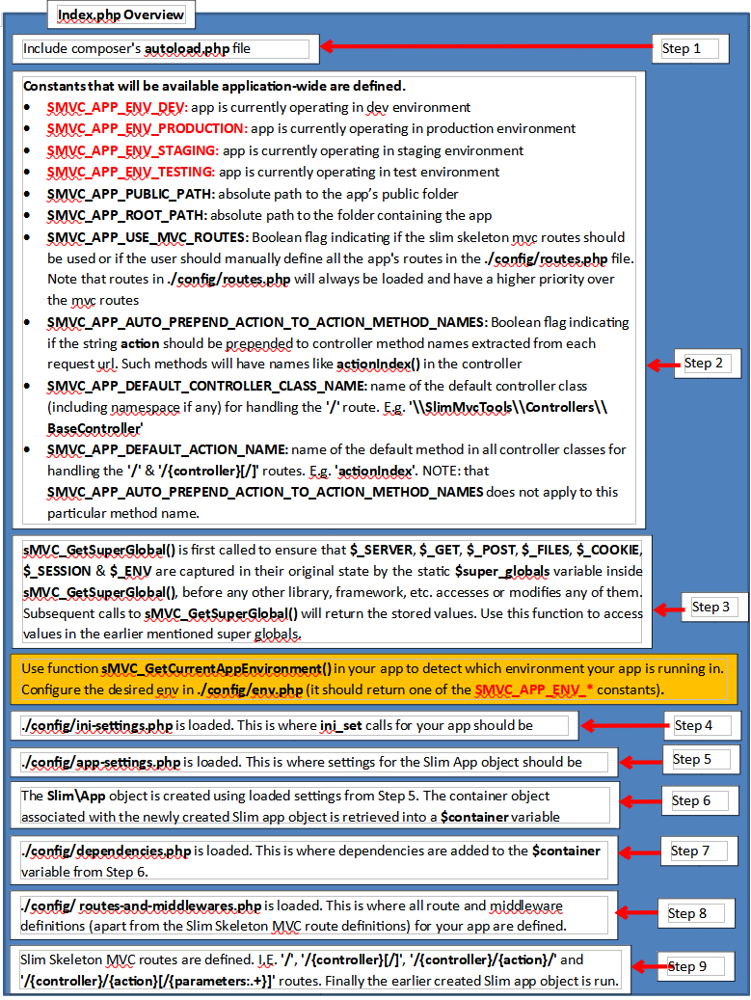
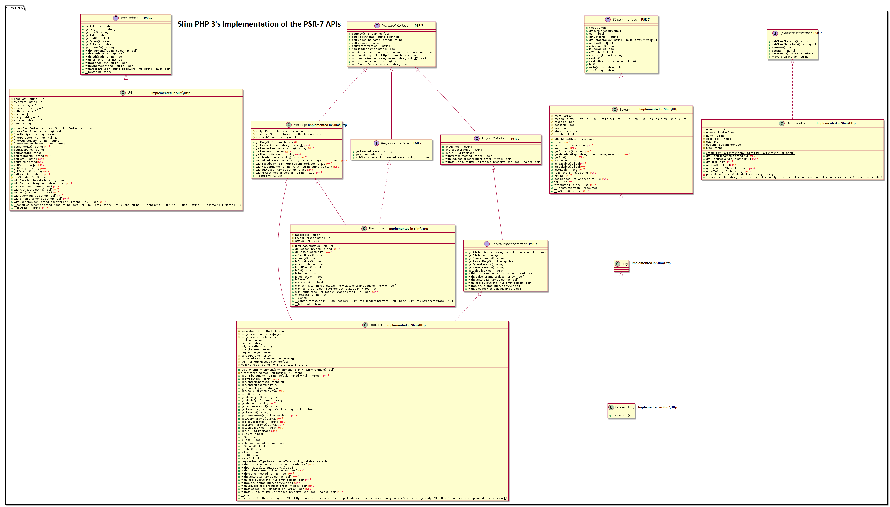

# SlimPHP 3 Skeleton MVC App [STABLE VERSION WILL BE READY BY MID APRIL 2017.]

This is a template web-application (powered by SlimPHP 3), that can be extended to build more complex web applications.

It adds the Model-View-Controller structure to a SlimPHP3 web-application.

It ships with the Foundation 5 template (http://foundation.zurb.com/).

## Requirements

* PHP 5.5+
* Pdo sqlite (3) extension for Authentication in non-production environments
* Composer (https://getcomposer.org)

## Installation (Creating a Project)

* Get the most recent development version (creates the project from the master branch in the repo)

  **`$ composer create-project -n -s dev rotexsoft/slim3-skeleton-mvc-app my-app`**

* Get the most stable version (creates the project from the most recent tagged release in the repo)

  **`$ composer create-project -n rotexsoft/slim3-skeleton-mvc-app my-app`**

### Testing the Installation

1. **`$ cd my-app`**

2. **`$ php -S 0.0.0.0:8888 -t public`**

3. Browse to [http://localhost:8888](http://localhost:8888)

  * Below are the default links that are available upon installation:

    * [http://localhost:8888/base-controller/action-index/](http://localhost:8888/base-controller/action-index/) same as [http://localhost:8888/base-controller/](http://localhost:8888/base-controller/)
    * [http://localhost:8888/base-controller/action-login/](http://localhost:8888/base-controller/action-login/) comes with 2 default accounts **admin:admin** and **root:root**
    * [http://localhost:8888/base-controller/action-logout/0](http://localhost:8888/base-controller/action-logout/0)
    * [http://localhost:8888/base-controller/action-logout/1](http://localhost:8888/base-controller/action-logout/1)
    * [http://localhost:8888/base-controller/action-login-status/](http://localhost:8888/base-controller/action-login-status/)
    * [http://localhost:8888/hello/action-index/](http://localhost:8888/hello/action-index/) same as [http://localhost:8888/hello/](http://localhost:8888/hello/)
    * [http://localhost:8888/hello/action-login/](http://localhost:8888/hello/action-login/) comes with 2 default accounts **admin:admin** and **root:root**
    * [http://localhost:8888/hello/action-logout/0](http://localhost:8888/hello/action-logout/0)
    * [http://localhost:8888/hello/action-logout/1](http://localhost:8888/hello/action-logout/1)
    * [http://localhost:8888/hello/action-login-status/](http://localhost:8888/hello/action-login-status/)
    * `http://localhost:8888/hello/action-world/{name}/{another_parameter}`
      * you can do stuff like [http://localhost:8888/hello/action-world/john/doe](http://localhost:8888/hello/action-world/john/doe)

  * The `action-` prefix can be omitted from the links above if `S3MVC_APP_AUTO_PREPEND_ACTION_TO_ACTION_METHOD_NAMES` is set to `true`
    * For example [http://localhost:8888/hello/action-login/](http://localhost:8888/hello/action-login/) will become [http://localhost:8888/hello/login/](http://localhost:8888/hello/login/)

* You may need to modify the **`RewriteBase`** directive in the **`public/.htaccess`** file, if you are using aliases in your apache web server and are getting 404 errors
* You may need to set the **session.save_path** value via a call to **ini_set** in the **`config/ini-settings.php`** file, so that sessions would work properly

## Key Directories and Configuration
* **`config`:** Contains files for configuring the application
 
* **`logs`:** Log files

* **`public`:** Webserver root

* **`public/css`:** Your application's css files should be placed here 

* **`public/image`:** Your application's image files should be placed here

* **`public/js`:** Your application's javascript files should be placed here

* **`src/controllers`:** Your application's controller classes should be placed here

* **`src/layout-templates`:** The layout template(s) for your application should be placed here

* **`src/models`:** Your application's model classes should be placed here

* **`src/views`:** Should contain view files (associated with each of your controller classes' action) that should be rendered into your application's layout template(s)

* **`tests`:** Place files for testing your application (eg. PHPUnit test cases) here

* **`tmp`:** Temporary files generated by your application (like session files) should be placed here

* **`vendor`:** Composer dependencies


## Key Files and Configuration
* **`composer.json`:** contains your application's composer dependencies

* **`README.md`:** Add documentation for your application here.

* **`config/dependencies.php`:** Add dependencies to SlimPHP3's dependency injection container (ie. Pimple) here.

    * Below are the objects that are registered in the container:

        * **`errorHandler:`** An anonymous function that handles all uncaught PHP exceptions in your application. See http://www.slimframework.com/docs/handlers/error.html for more details.

        * **`notFoundHandler:`** An anonymous function that handles all request urls that do not match any of the routes defined in your application (ie. in **`public/index.php`** or **`config/routes.php`**). See http://www.slimframework.com/docs/handlers/not-found.html for more details. 
            * The handler for this framework is slighlty different from the pure Slim 3 one in that it adds two additional optional parameters in addition to the request and response parameters specified in the Slim 3 framework's default handler:
            ```php
            <?php
                function (
                    \Psr\Http\Message\ServerRequestInterface $request, 
                    \Psr\Http\Message\ResponseInterface $response,
                    $_404_page_contents_str = null,
                    $_404_page_additional_log_msg = null
                )
            ?>
            ```
        * **`notAllowedHandler:`** An anonymous function that handles all requests whose **HTTP Request Method** does not match any of the **HTTP Request Methods** associated with the routes defined in your application (ie. in **`public/index.php`** or **`config/routes.php`**). See http://www.slimframework.com/docs/handlers/not-allowed.html for more details.

        * **`logger:`** A PSR-3 compliant logger, that can be used for logging in your application. See https://bitbucket.org/jelofson/vespula.log for more details on how to configure this logger to suit your application's needs.

            ```php
            <?php
                //You can access the logger from within your controller like so:
                $this->container->get('logger');
            ?>
            ```

        * **`namespaces_for_controllers:`** An array containing a list of the namespaces that your application's controller classes belong to. If all your controllers are in the global namespace (like the **`Hello`** controller that ships with this package), then you don't need to update **`namespaces_for_controllers`**. The default namespace that ships with this package is **`'\\Slim3MvcTools\\Controllers\\'`** (the namespace where **`BaseController`** belongs).  

        * **`new_layout_renderer:`** An object used for rendering layout-template(s) for your application (see the **`renderLayout`** method in **`vendor/rotexsoft/slim3-skeleton-mvc-tools/src/BaseController.php`**). See https://github.com/rotexsoft/file-renderer for more details on how to configure this object.

            ```php
            <?php
                //You can access this renderer from within your controller methods like so:
                $this->layout_renderer; //it is automatically set as a property of the controller 
                                        //object, as long as your controller object which should be
                                        //extending \Slim3MvcTools\Controllers\BaseController calls 
                                        //parent::__construct(...) in its own constructor.

                //You can also access this renderer from within your controller methods like so:
                $this->container->get('new_layout_renderer'); //keep in mind that accessing it like 
                                                              //this returns a new instance with 
                                                              //each call.

                //There is also a helper method available in all your controllers that
                //extend \Slim3MvcTools\Controllers\BaseController called renderLayout 
                //via which you can interact with $this->layout_renderer
            ?>
            ```

        * **`new_view_renderer:`** An object used for rendering view file(s) associated with each action method in the controller(s) for your application (see the **`renderView`** method in **`vendor/rotexsoft/slim3-skeleton-mvc-tools/src/BaseController.php`**). See https://github.com/rotexsoft/file-renderer for more details on how to configure this object.

            ```php
            <?php
                //You can access this renderer from within your controller methods like so:
                $this->view_renderer; //it is automatically set as a property of the controller 
                                      //object, as long as your controller object which should be
                                      //extending \Slim3MvcTools\Controllers\BaseController calls 
                                      //parent::__construct(...) in its own constructor.

                //You can also access this renderer from within your controller methods like so:
                $this->container->get('new_view_renderer'); //keep in mind that accessing it like
                                                            //this returns a new instance with 
                                                            //each call.

                //There is also a helper method available in all your controllers that
                //extend \Slim3MvcTools\Controllers\BaseController called renderView 
                //via which you can interact with $this->view_renderer
            ?>
            ```

        * **`vespula_auth:`** An object used by the **`BaseController`** to implement authentication functionality (see the **`isLoggedIn`**, **`actionLogin`**, **`actionLogout`** and **`actionLoginStatus`** methods in **`vendor/rotexsoft/slim3-skeleton-mvc-tools/src/BaseController.php`**). See https://bitbucket.org/jelofson/vespula.auth for more details on how to configure this object.

            ```php
            <?php
                //You can access the auth object from within your controller like so:
                $this->container->get('vespula_auth');
            ?>
            ```

* **`config/env.php`:** Edit it to define your application's environment. It should return one of **S3MVC_APP_ENV_DEV**, **S3MVC_APP_ENV_PRODUCTION**, **S3MVC_APP_ENV_STAGING** or **S3MVC_APP_ENV_TESTING** relevant to the environment you are installing your web-app.

* **`config/ini-settings.php`:** Modify ini settings via **`ini_set(..)`** here. Remember to update **`date.timezone`** in this file to match your timezone (see http://php.net/manual/en/timezones.php).

* **`config/routes.php`:** Add additional routes and middlewares (see https://www.slimframework.com/docs/concepts/middleware.html for more information on middlewares) for your application here (if needed). You can decide to define all the routes for your application here (in this case set the **S3MVC_APP_USE_MVC_ROUTES** constant in **`public/index.php`** to false). A default **`/`** route is defined in this file and will be active if **S3MVC_APP_USE_MVC_ROUTES** has a value of **`false`**.

* **`public/.htaccess`:** Apache web-server settings.

* **`public/index.php`:** Entry point to application.

	* **Figure 1: Overview of the index.php file** 

    * Below are some constants (some of which you may edit to suit your needs) and functions defined in this file:

        * **`S3MVC_APP_AUTO_PREPEND_ACTION_TO_ACTION_METHOD_NAMES:`** A boolean value. If true, the string **`'action'`** will be prepended to action method names (if the method name does not already start with the string **`'action'`**). The resulting method name will be converted to camel case before being executed. If false, then action method names will only be converted to camel case before being executed. This setting does not apply to **`S3MVC_APP_DEFAULT_ACTION_NAME`**. It only applies to the following routes **`'/{controller}/{action}[/{parameters:.+}]'`** and **`'/{controller}/{action}/'`**.

        * **`S3MVC_APP_DEFAULT_ACTION_NAME:`** A string value. This is the name of the action or method to be called on the default controller to handle the default **`/`** route. This method should return a response string (ie. valid html) or a PSR 7 response object containing valid html in its body. This default action or method should accept no arguments or parameters.

        * **`S3MVC_APP_DEFAULT_CONTROLLER_CLASS_NAME:`** A string value. This is used to create a controller object to handle the default **`/`** route. Must be prefixed with the namespace if the controller class is in a namespace.

        * **`s3MVC_GetCurrentAppEnvironment():`** This function detects which environment your web-app is running in (i.e. one of Production, Development, Staging or Testing). Below are its possible return values. You define your application's environment inside **`config/env.php`**.

            * **`S3MVC_APP_ENV_DEV:`** A string value representing that your application is running in development mode.

            * **`S3MVC_APP_ENV_PRODUCTION:`** A string value representing that your application is running in production / live mode.

            * **`S3MVC_APP_ENV_STAGING:`** A string value representing that your application is running in staging mode.

            * **`S3MVC_APP_ENV_TESTING:`** A string value representing that your application is running in testing mode.

        * **`S3MVC_APP_PUBLIC_PATH:`** A string value. The absolute path to the **`public`** folder in your application.

        * **`S3MVC_APP_ROOT_PATH:`** A string value. The absolute path the topmost level folder in your application (ie. the folder containing all your apps folders like **`src`**, **`config`**, etc).

        * **`S3MVC_APP_USE_MVC_ROUTES:`** A boolean value. If true, the mvc routes will be enabled. If false, then you must explicitly define all the routes for your application inside **`config/routes.php`** (like working with pure Slim 3).


* **`src/controllers/Hello.php`:** Example Controller class.

* **`src/layout-templates/main-template.php`:** Default site template based on Foundation 5.

* **`src/views/base/index.php`:** View file associated with the **`actionIndex`** method in **`vendor/rotexsoft/slim3-skeleton-mvc-tools/src/BaseController.php`**.

* **`src/views/base/login.php`:** View file associated with the **`actionLogin`** method in **`vendor/rotexsoft/slim3-skeleton-mvc-tools/src/BaseController.php`**.

* **`src/views/base/login-status.php`:** View file associated with the **`actionLoginStatus`** method in **`vendor/rotexsoft/slim3-skeleton-mvc-tools/src/BaseController.php`**.

* **`src/views/hello/world.php`:** View file associated with the **`actionWorld`** method in **`src/controllers/Hello.php`**.


## MVC Functionality
```php
<?php
namespace Slim3SkeletonMvcApp\Controllers;

class Hello extends \Slim3MvcTools\Controllers\BaseController
{
    public function __construct(
        \Interop\Container\ContainerInterface $container, 
		$controller_name_from_uri, $action_name_from_uri, 
        \Psr\Http\Message\ServerRequestInterface $req, 
		\Psr\Http\Message\ResponseInterface $res     
    ) {
        parent::__construct($container, $controller_name_from_uri, $action_name_from_uri, $req, $res);
    }
    
    public function actionIndex() {

        return 'in Hello::actionIndex()<br>';
    }
	
    public function actionThere($first_name, $last_name) {

        return "Hello There $first_name, $last_name";
    }
	
    public function preAction() {
        
		// add code that you need to be executed before each controller action method is executed
		$response = parent::preAction();
		
        return $response;
    }
    
    public function postAction(\Psr\Http\Message\ResponseInterface $response) {
		
        // add code that you need to be executed after each controller action method is executed
        $response = parent::postAction($response);
		
        return $response;
    }
}
?>
```
**Figure 2: an Hello Controller class**

* There are four routes that are defined in the **`./public/index.php`** file to handle MVC requests (if and only if **S3MVC_APP_USE_MVC_ROUTES** is set to **`true`**):
    * **`/`**: the **default route**. It creates an instance of the default controller (configurable via **S3MVC_APP_DEFAULT_CONTROLLER_CLASS_NAME**) and executes the default action method (configurable via **S3MVC_APP_DEFAULT_ACTION_NAME**) on the default controller. This route should be used for the home-page of your app.
        * For example, given **S3MVC_APP_DEFAULT_CONTROLLER_CLASS_NAME** with a value of **`'\\Slim3SkeletonMvcApp\\Controllers\\Hello'`** and **S3MVC_APP_DEFAULT_ACTION_NAME** with a value of **`'actionIndex()'`**, the **default route** will lead to the execution of **`'\\Slim3SkeletonMvcApp\\Controllers\\Hello::actionIndex()'`**
    * **`/{controller}[/]`**: the **controller only route**. It creates an instance of the controller specified in the url and executes the default action method (configurable via **S3MVC_APP_DEFAULT_ACTION_NAME**) on the specified controller.
        * For example, given a route with a value of **`/hello`** and **S3MVC_APP_DEFAULT_ACTION_NAME** with a value of **`'actionIndex()'`**, the **controller only route** will lead to the execution of **`'\\Slim3SkeletonMvcApp\\Controllers\\Hello::actionIndex()'`**
    * **`/{controller}/{action}/`**: the **controller and action only route**. It creates an instance of the controller specified in the url and executes the action method specified in the url on the specified controller. The specified method in the specified controller should not accept any parameters / arguments.
        * For example, given a route with a value of **`/hello/index/`**, the **controller and action only route** will lead to the execution of **`'\\Slim3SkeletonMvcApp\\Controllers\\Hello::actionIndex()'`**
    * **`/{controller}/{action}[/{parameters:.+}]`**: the **controller, action and optional parameters route**. It creates an instance of the controller specified in the url and executes the action method specified in the url (with the parameters specified in the url, if any) on the specified controller.
        * For example, given a route with a value of **`/hello/there/john/Doe`**, the **controller, action and optional parameters route** will lead to the execution of **`'\\Slim3SkeletonMvcApp\\Controllers\\Hello::actionThere('john', 'Doe')'`**
        * This route also responds to **`/{controller}/{action}`** (without a trailing slash). In this case the controller method specified via **`{action}`** part of the url must not accept any arguments or parameters.

* Controller classes must extend `\Slim3MvcTools\Controllers\BaseController`. These classes must be named using studly case / caps e.g. **StaticPages**, **MobileDataProviders** and must be referenced in the controller segment of the url in all lowercases with dashes preceding capital case characters (except for the first capital case character). For example, `http://localhost:8888/mobile-data-providers/` will be responded to by the default action (defined via **`S3MVC_APP_DEFAULT_ACTION_NAME`**; default value is **`actionIndex()`** ) method in the controller named **MobileDataProviders**, `http://localhost:8888/mobile-data-providers/list-providers` or `http://localhost:8888/mobile-data-providers/action-list-providers` (if **`S3MVC_APP_AUTO_PREPEND_ACTION_TO_ACTION_METHOD_NAMES`** is set to **`false`**) will be responded to by the **`actionListProviders()`** method in the controller named **`MobileDataProviders`**, etc.
    * Controller action methods should be named using camel case (e.g. **`listProviders()`** ). In addition, they must be prefixed with the word **`action`** if **`S3MVC_APP_AUTO_PREPEND_ACTION_TO_ACTION_METHOD_NAMES`** is set to `true`; in this case **`actionListProviders()`**)

* Action methods in Controller classes MUST either return a string (ie. containing the output to display to the client) or an instance of Psr\Http\Message\ResponseInterface (e.g. $response, that has the output to be displayed to the client, injected into it via $response->getBody()->write($data) );

* **`The default route with default controller and default action route handler:`** The default route handler responds to the **`/`** route by creating an instance of the default controller (defined via **`S3MVC_APP_DEFAULT_CONTROLLER_CLASS_NAME:`**) and calling the default action method (defined via **`S3MVC_APP_DEFAULT_ACTION_NAME:`**) on the controller object and returning the result as a response object (if the method returns a string the default route handler will write the string into a response object and return that object). 

* **`The controller with action and optional params route handler:`** The mvc route handler responds to the **`/{controller}/{action}[/{parameters:.+}]`** and **`/{controller}/{action}/`** routes by going through the steps below:
    * extracting the **`{controller}`**, **`{action}`** and **`{parameters}`** segments of a request uri. Eg. http://localhost:8888/hello/action-world/john/doe will lead to `hello` being extracted as the value of the **`{controller}`** segment, `action-world` being extracted as the value of the **`{action}`** segment and `['john', 'doe']` as the value of the **`{parameters}`** segment. It then converts the value of the **`{action}`** segment to camel case; in this case from `action-world` to `actionWorld`. If **`S3MVC_APP_AUTO_PREPEND_ACTION_TO_ACTION_METHOD_NAMES`** is set to `true` then the handler will try to prepend the string `'action'` to the camel-cased value of the **`{action}`** segment; however in this case it will not prepend the string `'action'` to `actionWorld` since it already starts with the string `action`. It then goes on to validate that `actionWorld` is a valid name for a php class' method name, if it's an invalid name it will invoke the **`notFoundHandler`** which will lead to a 404 not found response. If it's avalid method name it tries to create an instance of a controller class by first converting the value of the **`{controller}`** segment, in this case `hello`, to studly case which will lead to `hello` being converted to `Hello` and it then goes on to validate that `Hello` is a valid name for a php class, if it's an invalid name it will invoke the **`notFoundHandler`** which will lead to a 404 not found response. If it's a valid class name, it then goes on to check if the class exists in the gloabal namespace first, and if not, then it continues checking in the namespaces registered in the container (**`namespaces_for_controllers`**). If the class does not exist, it will invoke the **`notFoundHandler`** which will lead to a 404 not found response. Else if the class exists, an instance will be created. The handler then goes on to check if the method named `actionWorld` exists in the instance of the controller class just created. If the method doesn't exist, the handler will invoke the **`notFoundHandler`** which will lead to a 404 not found response. Else if the method exists it will be called on the created controller object with the values of the **`{parameters}`** segment (in this case `['john', 'doe']`) as arguments (ie. $instance_of_hello_controller->actionWorld('john', 'doe')) and the result will be returned as a response object (if the method returns a string the handler will write the string into a response object and return that object). Note that if there are no values supplied for the **`{parameters}`** segment, the action method will be called on the controller with no parameter ($instance_of_hello_controller->actionWorld()) this happens when the **`/{controller}/{action}/`** route is matched. 
    
* **`The controller with no action and params route handler:`** `/{controller}[/]`: works in a similar manner that the handler that handles the **`/{controller}/{action}[/{parameters:.+}]`** and **`/{controller}/{action}/`** routes. Except that the value of **`S3MVC_APP_DEFAULT_ACTION_NAME`** is used for the method name and the method will always be invoke with no parameters.

### **Controller Execution Flow** 
Middlewares added to your app, like the one in **Figure 6**, will be executed for all routes (MVC ones above included) in your app.
You can also use the **`preAction()`** and  **`postAction(\Psr\Http\Message\ResponseInterface $response)`** methods 
in any of your controllers to inject code you want to be executed before and after each action method is run during 
a request to an action in a specific controller. You can create a BaseController 
(which extends `\Slim3MvcTools\Controllers\BaseController`) in your app which all 
your app's controllers will extend. This BaseController's 
**`preAction()`** and  **`postAction(\Psr\Http\Message\ResponseInterface $response)`** methods
can then be used to implement common logic which you want to be executed before and after any 
action method is run in any of your controllers.

In a nutshell; for each request, middleware code is first executed 
(in Slim 3 the handler associated with the route matched for the current request
is also executed as a middleware). When the route handler for any of the MVC routes mentioned above is executed,
the **`preAction()`** method for the current controller is executed first, followed by the current action method
and then followed by the **`postAction(\Psr\Http\Message\ResponseInterface $response)`** method for the current 
controller. Finally, other middleware code (if any) is executed after the route handler for the current request 
has been executed. 

Given the code in **figures 5** and **6** below, executing **`http://localhost:8888/hello/`** will generate the output in Figure 3 below and executing **`http://localhost:8888/hello/action-there/john/Doe`** (or **`http://localhost:8888/hello/there/john/Doe`** if **S3MVC_APP_AUTO_PREPEND_ACTION_TO_ACTION_METHOD_NAMES** is set to **`true`**) will generate the output in Figure 4 below:

```
in Middleware before current route handler
in Hello::__construct(...)
in Hello::preAction()
in Hello::actionIndex()
in Hello::postAction(\Psr\Http\Message\ResponseInterface $response)
in Middleware after current route handler
```
**Figure 3: Output of executing** `http://localhost:8888/hello/`

```
in Middleware before current route handler
in Hello::__construct(...)
in Hello::preAction()
Hello There john, Doe
in Hello::postAction(\Psr\Http\Message\ResponseInterface $response)
in Middleware after current route handler
```
**Figure 4: Output of executing** `http://localhost:8888/hello/action-there/john/Doe`

```php
<?php
namespace Slim3SkeletonMvcApp\Controllers;

class Hello extends \Slim3MvcTools\Controllers\BaseController
{
    public function __construct(
        \Interop\Container\ContainerInterface $container, 
		$controller_name_from_uri, $action_name_from_uri, 
        \Psr\Http\Message\ServerRequestInterface $req, 
		\Psr\Http\Message\ResponseInterface $res     
    ) {
        parent::__construct($container, $controller_name_from_uri, $action_name_from_uri, $req, $res);
		$this->response->getBody()->write('in Hello::__construct(...)<br>'); 
    }
    
    public function actionIndex() {

        return 'in Hello::actionIndex()<br>';
    }
	
    public function actionThere($first_name, $last_name) {

        return "Hello There $first_name, $last_name<br>";
    }
	
    public function preAction() {
        
		// add code that you need to be executed before each controller action method is executed
		$response = parent::preAction();
		$response->getBody()->write('in Hello::preAction()<br>'); 
		
        return $response;
    }
    
    public function postAction(\Psr\Http\Message\ResponseInterface $response) {
		
        // add code that you need to be executed after each controller action method is executed
        $response = parent::postAction($response);
		$response->getBody()->write('in Hello::postAction(\Psr\Http\Message\ResponseInterface $response)<br>');
		
        return $response;
    }
}
```
**Figure 5: Example Hello Controller Class**

```php
<?php
$app->add(function (\Psr\Http\Message\ServerRequestInterface $request, \Psr\Http\Message\ResponseInterface $response, $next) {

    $response->getBody()->write('in Middleware before current route handler<br>');
	
	$new_response = $next($request, $response); // this will eventually execute the route handler
												// for the matched route for the current request.
												// This is where the controller is instantiated 
												// and the appropriate controller method is 
												// invoked with / without parameters.
												
    $new_response->getBody()->write('in Middleware after current route handler<br>');
    
    return $new_response;
});
```
**Figure 6: Sample middleware that should be placed in `./config/routes.php`**

### **Using the File Renderer for Rendering Views and Layouts inside Controller Action Methods** 
????????????
Talk about cascading view system in renderView( $file_name, array $data = [] ).

### **Creating Controller Classes via the Commnadline** 
????????????
????????????
* Helper script for creating controller classes and a default index view:

        `php ./vendor/rotexsoft/slim3-skeleton-mvc-tools/src/scripts/create-controller.php`


### S3MVC Helper Functions
* **`s3MVC_CreateController(\Interop\Container\ContainerInterface $container, $controller_name_from_url, $action_name_from_url, \Psr\Http\Message\ServerRequestInterface $request, \Psr\Http\Message\ResponseInterface $response)`:** used by the route handlers to create controllers to handle mvc routes. You should not really need to call this function.
* **`s3MVC_DumpVar($v)`:** for dumping variables during development for debugging purposes.
* **`s3MVC_GetBaseUrlPath()`:** performs the same function as \Slim\Http\Uri::getBasePath()
* **`s3MVC_MakeLink($path)`:** prepends **s3MVC_GetBaseUrlPath()** followed by **/** to $path and returns the prepended string. Use this for generating links in your application.
* **`s3MVC_GetSuperGlobal($global_name='', $key='', $default_val='')`:** a helper function for accessing super globals.
* **`s3MVC_UriToString(\Psr\Http\Message\UriInterface $uri)`:** a helper function for converting PSR-7 uri objects to a string.
* **`s3MVC_addQueryStrParamToUri(\Psr\Http\Message\UriInterface $uri, $param_name, $param_value)`:** a helper function for adding query string parameters to PSR-7 uri objects.
* **`s3MVC_psr7RequestObjToString(\Psr\Http\Message\ServerRequestInterface $req,...)`:** a helper function for dumping PSR-7 request objects for debugging purposes.
* **`s3MVC_psr7UploadedFileToString(\Psr\Http\Message\UploadedFileInterface $file)`:** a helper function for dumping PSR-7 file objects for debugging purposes.


## Security Considerations
* Make sure to validate / sanitize the password value posted to `\Slim3MvcTools\Controllers\BaseController::actionLogin()` in your Controller(s). It is deliberately left un-sanitized and un-validated because each application should define which characters are allowed in passwords and validation / sanitization should be based on the allowed characters.

## Documentation for Components Used
* SlimPHP 3 http://www.slimframework.com/docs/
* Slim3 Skeleton MVC Tools https://github.com/rotexsoft/slim3-skeleton-mvc-tools contains BaseController.php and other Slim3 Skeleton MVC specific classes and functions 
* Vespula.Log https://bitbucket.org/jelofson/vespula.log (a PSR-3 compliant logger)
* Vespula.Auth for Authentication https://bitbucket.org/jelofson/vespula.auth
* File-Renderer https://github.com/rotexsoft/file-renderer for rendering the template and view files
* See http://pimple.sensiolabs.org/ for more information on how the dependency injection container used by *SlimPHP 3* works


## References
* https://getcomposer.org/doc/articles/scripts.md
* https://devedge.wordpress.com/2014/11/05/building-better-project-skeletons-with-composer-2/
* http://www.binpress.com/tutorial/better-project-skeletons-with-composer/157


## SlimPHP 3's Implementation of PSR-7


