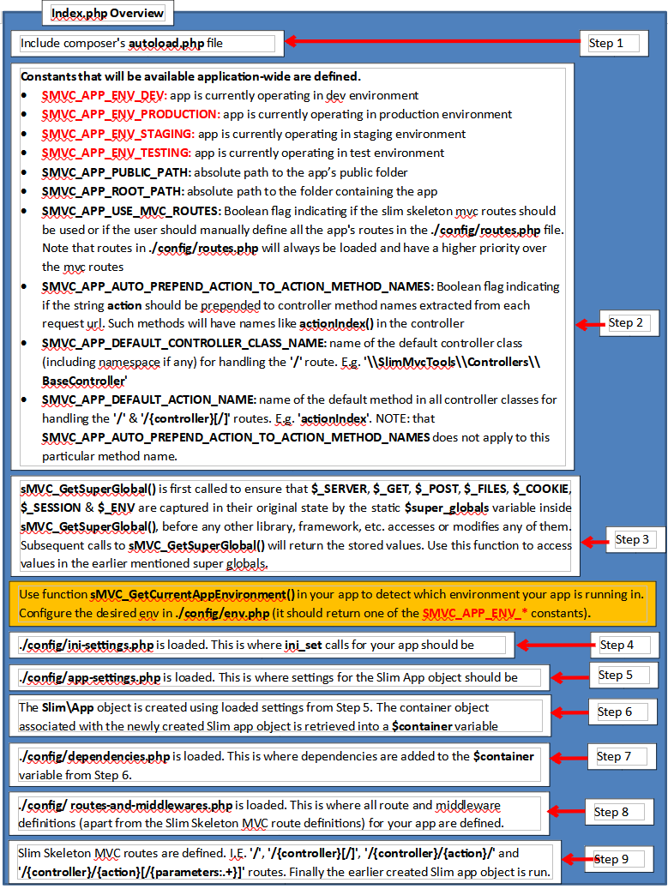

# Quick Start Guide

## Installation (Creating a Project)

* Get the most recent development version (creates the project from the master branch in the repo)

  **`$ composer create-project -n -s dev rotexsoft/slim3-skeleton-mvc-app my-app`**

* Get the most stable version (creates the project from the most recent tagged release in the repo)

  **`$ composer create-project -n rotexsoft/slim3-skeleton-mvc-app my-app`**

### Testing the Installation

1. **`$ cd my-app`**

2. **`$ php -S 0.0.0.0:8888 -t public`**

3. Browse to [http://localhost:8888](http://localhost:8888)

    * **Automatic routing scheme for mapping request urls to methods in Controller classes that are sub-classes of Slim3MvcTools\Controllers\BaseController:** urls in the form of
		> `http(s)://server:port[/]<base-path>[/][<controller-name>][/<method-name>][/param1]...[/paramN]`
	can be automatically mapped to be responded to by a specific method in a Controller class.

    * Below are the default links that are available upon installation:

        * [http://localhost:8888/base-controller/action-index/](http://localhost:8888/base-controller/action-index/) same as [http://localhost:8888/base-controller/](http://localhost:8888/base-controller/)
            * This link is mapped to **`\Slim3MvcTools\Controllers\BaseController::actionIndex()`** under the hood

        * [http://localhost:8888/base-controller/action-login/](http://localhost:8888/base-controller/action-login/) comes with 2 default accounts **admin:admin** and **root:root**
            * This link is mapped to **`\Slim3MvcTools\Controllers\BaseController::actionLogin()`** under the hood

        * [http://localhost:8888/base-controller/action-logout/0](http://localhost:8888/base-controller/action-logout/0)
            * This link is mapped to **`\Slim3MvcTools\Controllers\BaseController::actionLogout($show_status_on_completion = false)`** under the hood

        * [http://localhost:8888/base-controller/action-logout/1](http://localhost:8888/base-controller/action-logout/1)
            * This link is mapped to **`\Slim3MvcTools\Controllers\BaseController::actionLogout($show_status_on_completion = false)`** under the hood

        * [http://localhost:8888/base-controller/action-login-status/](http://localhost:8888/base-controller/action-login-status/)
            * This link is mapped to **`\Slim3MvcTools\Controllers\BaseController::actionLoginStatus()`** under the hood

        * [http://localhost:8888/hello/action-index/](http://localhost:8888/hello/action-index/) same as [http://localhost:8888/hello/](http://localhost:8888/hello/)
            * This link is mapped to **`\Slim3SkeletonMvcApp\Controllers\Hello::actionIndex()`** under the hood

        * [http://localhost:8888/hello/action-login/](http://localhost:8888/hello/action-login/) comes with 2 default accounts **admin:admin** and **root:root**
            * This link is mapped to **`\Slim3SkeletonMvcApp\Controllers\Hello::actionLogin()`** under the hood

        * [http://localhost:8888/hello/action-logout/0](http://localhost:8888/hello/action-logout/0)
            * This link is mapped to **`\Slim3SkeletonMvcApp\Controllers\Hello::actionLogout($show_status_on_completion = false)`** under the hood

        * [http://localhost:8888/hello/action-logout/1](http://localhost:8888/hello/action-logout/1)
            * This link is mapped to **`\Slim3SkeletonMvcApp\Controllers\Hello::actionLogout($show_status_on_completion = false)`** under the hood

        * [http://localhost:8888/hello/action-login-status/](http://localhost:8888/hello/action-login-status/)
            * This link is mapped to **`\Slim3SkeletonMvcApp\Controllers\Hello::actionLoginStatus()`** under the hood

        * `http://localhost:8888/hello/action-there/{first_name}/{last_name}`
            * This link is mapped to **`\Slim3SkeletonMvcApp\Controllers\Hello::actionThere($first_name, $last_name)`** under the hood
            * you can do stuff like [http://localhost:8888/hello/action-there/john/doe](http://localhost:8888/hello/action-there/john/doe)

        * `http://localhost:8888/hello/action-world/{name}/{another_parameter}`
            * This link is mapped to **`\Slim3SkeletonMvcApp\Controllers\Hello::actionWorld($name, $another_param)`** under the hood
            * you can do stuff like [http://localhost:8888/hello/action-world/john/doe](http://localhost:8888/hello/action-world/john/doe)

    * The **`action-`** prefix can be omitted from the links above if **`S3MVC_APP_AUTO_PREPEND_ACTION_TO_ACTION_METHOD_NAMES`** is set to **`true`**
        * For example [http://localhost:8888/hello/action-login/](http://localhost:8888/hello/action-login/) will become [http://localhost:8888/hello/login/](http://localhost:8888/hello/login/) and [http://localhost:8888/hello/action-there/john/doe](http://localhost:8888/hello/action-there/john/doe) will become [http://localhost:8888/hello/there/john/doe](http://localhost:8888/hello/there/john/doe)

4. You may need to modify the **`RewriteBase`** directive in the **`public/.htaccess`** file, if you are using aliases in your apache web server and are getting 404 errors

5. You may need to set the **session.save_path** value via a call to **ini_set** in the **`config/ini-settings.php`** file, so that sessions would work properly

## Key Directories and Configuration
* **`config`:** Contains files for configuring the application
 
* **`logs`:** Log files

* **`public`:** Webserver root

* **`public/css`:** Your application's css files should be placed here 

* **`public/image`:** Your application's image files should be placed here

* **`public/js`:** Your application's javascript files should be placed here

* **`src/controllers`:** Your application's controller classes should be placed here

* **`src/layout-templates`:** The layout template(s) for your application should be placed here

* **`src/models`:** Your application's model classes should be placed here

* **`src/views`:** Should contain view files (associated with each of your controller classes' action) that should be rendered into your application's layout template(s)

* **`tests`:** Place files for testing your application (eg. PHPUnit test cases) here

* **`tmp`:** Temporary files generated by your application (like session files) should be placed here

* **`vendor`:** Composer dependencies

## Key Files and Configuration
* **`composer.json`:** contains your application's composer dependencies

* **`README.md`:** Add documentation for your application here.

* **`config/dependencies.php`:** Add dependencies to SlimPHP3's dependency injection container (ie. Pimple) here.

    * Below are the objects that are registered in the container:

        * **`errorHandler:`** An anonymous function that handles all uncaught PHP exceptions in your application. See http://www.slimframework.com/docs/handlers/error.html for more details.

        * **`notFoundHandler:`** An anonymous function that handles all request urls that do not match any of the routes defined in your application (ie. in **`public/index.php`** or **`config/routes-and-middlewares.php`**). See http://www.slimframework.com/docs/handlers/not-found.html for more details. 
            * The handler for this framework is slighlty different from the pure Slim 3 one in that it adds two additional optional parameters in addition to the request and response parameters specified in the Slim 3 framework's default handler:
            ```php
            <?php
                function (
                    \Psr\Http\Message\ServerRequestInterface $request, 
                    \Psr\Http\Message\ResponseInterface $response,
                    $_404_page_contents_str = null,
                    $_404_page_additional_log_msg = null
                )
            ?>
            ```
        * **`notAllowedHandler:`** An anonymous function that handles all requests whose **HTTP Request Method** does not match any of the **HTTP Request Methods** associated with the routes defined in your application (ie. in **`public/index.php`** or **`config/routes-and-middlewares.php`**). See http://www.slimframework.com/docs/handlers/not-allowed.html for more details.

        * **`logger:`** A PSR-3 compliant logger, that can be used for logging in your application. See https://bitbucket.org/jelofson/vespula.log for more details on how to configure this logger to suit your application's needs.

            ```php
            <?php
                //You can access the logger from within your controller like so:
                $this->container->get('logger');
            ?>
            ```

        * **`namespaces_for_controllers:`** An array containing a list of the namespaces that your application's controller classes belong to. If all your controllers are in the global namespace (like the **`Hello`** controller that ships with this package), then you don't need to update **`namespaces_for_controllers`**. The default namespace that ships with this package is **`'\\Slim3MvcTools\\Controllers\\'`** (the namespace where **`BaseController`** belongs).  

        * **`new_layout_renderer:`** An object used for rendering layout-template(s) for your application (see the **`renderLayout`** method in **`vendor/rotexsoft/slim3-skeleton-mvc-tools/src/BaseController.php`**). See https://github.com/rotexsoft/file-renderer for more details on how to configure this object.

            ```php
            <?php
                //You can access this renderer from within your controller methods like so:
                $this->layout_renderer; //it is automatically set as a property of the controller 
                                        //object, as long as your controller object which should be
                                        //extending \Slim3MvcTools\Controllers\BaseController calls 
                                        //parent::__construct(...) in its own constructor.

                //You can also access this renderer from within your controller methods like so:
                $this->container->get('new_layout_renderer'); //keep in mind that accessing it like 
                                                              //this returns a new instance with 
                                                              //each call.

                //There is also a helper method available in all your controllers that
                //extend \Slim3MvcTools\Controllers\BaseController called renderLayout 
                //via which you can interact with $this->layout_renderer
            ?>
            ```

        * **`new_view_renderer:`** An object used for rendering view file(s) associated with each action method in the controller(s) for your application (see the **`renderView`** method in **`vendor/rotexsoft/slim3-skeleton-mvc-tools/src/BaseController.php`**). See https://github.com/rotexsoft/file-renderer for more details on how to configure this object.

            ```php
            <?php
                //You can access this renderer from within your controller methods like so:
                $this->view_renderer; //it is automatically set as a property of the controller 
                                      //object, as long as your controller object which should be
                                      //extending \Slim3MvcTools\Controllers\BaseController calls 
                                      //parent::__construct(...) in its own constructor.

                //You can also access this renderer from within your controller methods like so:
                $this->container->get('new_view_renderer'); //keep in mind that accessing it like
                                                            //this returns a new instance with 
                                                            //each call.

                //There is also a helper method available in all your controllers that
                //extend \Slim3MvcTools\Controllers\BaseController called renderView 
                //via which you can interact with $this->view_renderer
            ?>
            ```

        * **`vespula_auth:`** An object used by the **`BaseController`** to implement authentication functionality (see the **`isLoggedIn`**, **`actionLogin`**, **`actionLogout`** and **`actionLoginStatus`** methods in **`vendor/rotexsoft/slim3-skeleton-mvc-tools/src/BaseController.php`**). See https://bitbucket.org/jelofson/vespula.auth for more details on how to configure this object.

            ```php
            <?php
                //You can access the auth object from within your controller like so:
                $this->container->get('vespula_auth');
            ?>
            ```

* **`config/env.php`:** Edit it to define your application's environment. It should return one of **S3MVC_APP_ENV_DEV**, **S3MVC_APP_ENV_PRODUCTION**, **S3MVC_APP_ENV_STAGING** or **S3MVC_APP_ENV_TESTING** relevant to the environment you are installing your web-app.

* **`config/ini-settings.php`:** Modify ini settings via **`ini_set(..)`** here. Remember to update **`date.timezone`** in this file to match your timezone (see http://php.net/manual/en/timezones.php).

* **`config/routes-and-middlewares.php`:** Add additional routes and middlewares (see https://www.slimframework.com/docs/concepts/middleware.html for more information on middlewares) for your application here (if needed). You can decide to define all the routes for your application here (in this case set the **S3MVC_APP_USE_MVC_ROUTES** constant in **`public/index.php`** to false). A default **`/`** route is defined in this file and will be active if **S3MVC_APP_USE_MVC_ROUTES** has a value of **`false`**.

* **`public/.htaccess`:** Apache web-server settings.

* **`public/index.php`:** Entry point to application.

	* **Figure 1: Overview of the index.php file** 

    * Below are some constants (some of which you may edit to suit your needs) and functions defined in this file (i.e. **`public/index.php`**):

        * **`S3MVC_APP_AUTO_PREPEND_ACTION_TO_ACTION_METHOD_NAMES:`** A boolean value. If true, the string **`'action'`** will be prepended to action method names (if the method name does not already start with the string **`'action'`**). The resulting method name will be converted to camel case before being executed. If false, then action method names will only be converted to camel case before being executed. This setting does not apply to **`S3MVC_APP_DEFAULT_ACTION_NAME`**. It only applies to the following routes **`'/{controller}/{action}[/{parameters:.+}]'`** and **`'/{controller}/{action}/'`**.

        * **`S3MVC_APP_DEFAULT_ACTION_NAME:`** A string value. This is the name of the action or method to be called on the default controller to handle the default **`/`** route. This method should return a response string (ie. valid html) or a PSR 7 response object containing valid html in its body. This default action or method should accept no arguments or parameters.

        * **`S3MVC_APP_DEFAULT_CONTROLLER_CLASS_NAME:`** A string value. This is used to create a controller object to handle the default **`/`** route. Must be prefixed with the namespace if the controller class is in a namespace.

        * **`s3MVC_GetCurrentAppEnvironment():`** This function detects which environment your web-app is running in (i.e. one of Production, Development, Staging or Testing). Below are its possible return values. You define your application's environment inside **`config/env.php`**.

            * **`S3MVC_APP_ENV_DEV:`** A string value representing that your application is running in development mode.

            * **`S3MVC_APP_ENV_PRODUCTION:`** A string value representing that your application is running in production / live mode.

            * **`S3MVC_APP_ENV_STAGING:`** A string value representing that your application is running in staging mode.

            * **`S3MVC_APP_ENV_TESTING:`** A string value representing that your application is running in testing mode.

        * **`S3MVC_APP_PUBLIC_PATH:`** A string value. The absolute path to the **`public`** folder in your application.

        * **`S3MVC_APP_ROOT_PATH:`** A string value. The absolute path the topmost level folder in your application (ie. the folder containing all your apps folders like **`src`**, **`config`**, etc).

        * **`S3MVC_APP_USE_MVC_ROUTES:`** A boolean value. If true, the mvc routes will be enabled. If false, then you must explicitly define all the routes for your application inside **`config/routes-and-middlewares.php`** (like working with pure Slim 3).

* **`src/controllers/Hello.php`:** Example Controller class.

* **`src/layout-templates/main-template.php`:** Default site template based on the Zurb Foundation front-end framework.

* **`src/views/base/index.php`:** View file associated with the **`actionIndex`** method in **`vendor/rotexsoft/slim3-skeleton-mvc-tools/src/BaseController.php`**.

* **`src/views/base/login.php`:** View file associated with the **`actionLogin`** method in **`vendor/rotexsoft/slim3-skeleton-mvc-tools/src/BaseController.php`**.

* **`src/views/base/login-status.php`:** View file associated with the **`actionLoginStatus`** method in **`vendor/rotexsoft/slim3-skeleton-mvc-tools/src/BaseController.php`**.

* **`src/views/hello/world.php`:** View file associated with the **`actionWorld`** method in **`src/controllers/Hello.php`**.
